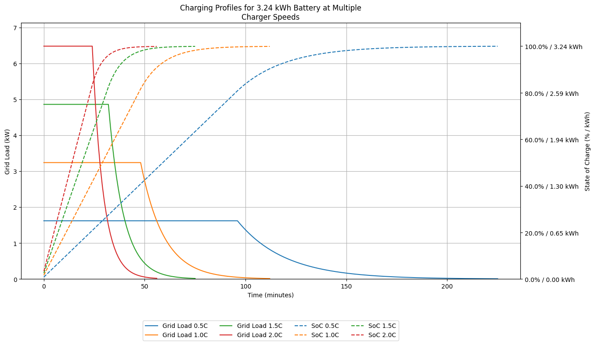

# Li-ion Charging Profile Generator

This Python script generates charging profiles for a lithium-ion battery with specified capacity and charger speeds, modeling both Constant Current (CC) and Constant Voltage (CV) phases. It produces lookup tables (CSV files) and visualizations (PDF plots) for individual charger speeds and a combined plot comparing multiple speeds.

## Features
- **Customizable Parameters**: Define battery capacity, charger efficiency, CC phase fraction, and charger speeds.
- **Iterative Lambda Optimization**: Adjusts the CV phase decay rate (lambda) to match target energy within a specified tolerance.
- **Output Generation**:
  - CSV files containing time, grid load, and state of charge (SoC) for each charger speed.
  - Individual PDF plots for each charger speed, showing grid load and SoC over time.
  - A combined PDF plot comparing grid load and SoC across all charger speeds.
- **Custom Visualizations**: Uses distinct colors and dual-axis plots for clear representation of grid load (kW) and SoC (%/kWh).

## Requirements
- Python 3.6 or higher
- Dependencies listed in `requirements.txt`:
  - `numpy`
  - `matplotlib`

## Installation
1. Clone the repository:
   ```bash
   git clone https://github.com/HallyStrats/li-ion_charging_profile.git
   cd li-ion_charging_profile
   ```
2. Create a virtual environment (optional but recommended):
   ```bash
   python -m venv venv
   source venv/bin/activate  # On Windows: venv\Scripts\activate
   ```
3. Install the required packages:
   ```bash
   pip install -r requirements.txt
   ```

## Usage
1. Ensure the script (`charging_profile.py`) and `requirements.txt` are in the same directory.
2. Modify the custom parameters in the script (if needed):
   - `BATTERY_CAPACITY`: Battery capacity in kWh (default: 3.24 kWh).
   - `CHARGER_EFFICIENCY`: Charger efficiency (default: 1).
   - `CC_FRACTION`: Fraction of energy delivered in CC phase (default: 0.80).
   - `CHARGER_SPEEDS`: List of charger speeds in C (default: [0.5, 1.0, 1.5, 2.0]).
3. Run the script:
   ```bash
   python charging_profile.py
   ```
4. Output will be saved in the `charging_profiles` directory:
   - **Lookup Tables**: CSV files in `charging_profiles/lookup_tables/` (e.g., `3.24kWh_charger_0.5C.csv`).
   - **Plots**: PDF files in `charging_profiles/plots/` (e.g., `3.24kWh_charger_0.5C.pdf` and `3.24kWh_charger_combined.pdf`).

## Output Details
- **CSV Files**: Each file contains:
  - `time`: Time in minutes.
  - `grid_load`: Power drawn from the grid in kW.
  - `soc`: State of Charge in percentage.
- **Individual Plots**: Show grid load (kW, solid line) and SoC (%/kWh, dotted line) for each charger speed.
- **Combined Plot**: Compares grid load and SoC across all charger speeds with distinct colors and a shared legend.

## Notes
- The script creates directories (`charging_profiles`, `lookup_tables`, `plots`) if they don't exist.
- The CV phase duration is calculated based on the CC phase duration and a predefined ratio.
- If the total charging time is too short, the script adjusts it to ensure a minimum CV phase duration of 1 minute.
- The iterative lambda optimization ensures the total energy delivered matches the target within a tolerance of 0.005 kWh.

## Example
For a 3.24 kWh battery with charger speeds [0.5, 1.0, 1.5, 2.0] C, the script generates:
- Four CSV files, one for each charger speed.
- Four individual PDF plots, one for each charger speed.
- One combined PDF plot comparing all charger speeds.

Example combined plot:


## Contributing
Contributions are welcome! Please submit a pull request or open an issue for suggestions or bug reports.